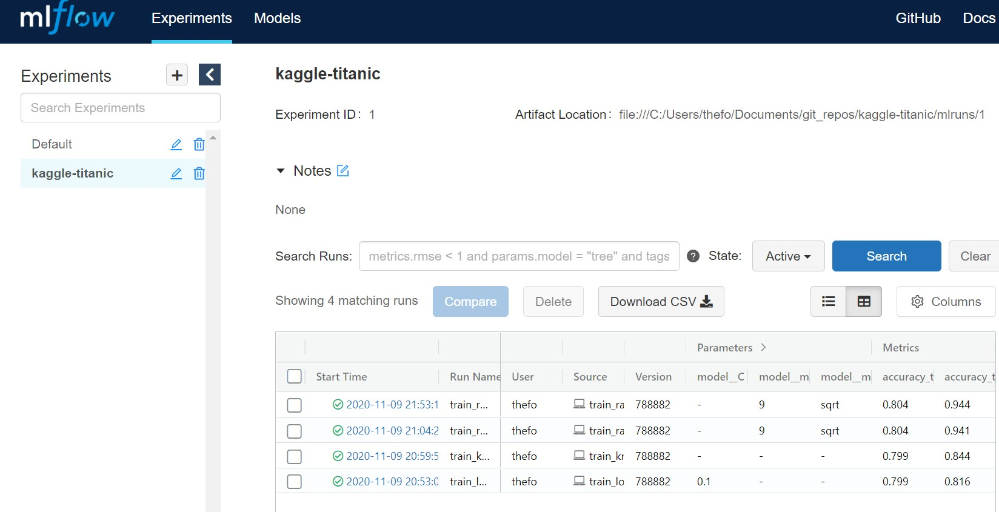

# Working with Kaggle Titanic Dataset

## About this repo
This repo contains the codes to do Exploratory Data Analysis and training of various machine learning models for the well-known Titanic dataset found on [Kaggle](https://www.kaggle.com/c/titanic/data). The codes for model training make use of [MLFlow](https://mlflow.org/), which is a great tool to keep track of hyperparameters and metrics when experimenting with various model types.

## Prerequisites
- Python 3.7+ / Conda installed

## Reproducing this repo
1. Navigate to your working directory, clone this repo, then navigate to the `kaggle-titanic` folder:
```
cd /path/to/working/directory
git clone https://github.com/yxlee245/kaggle-titanic.git
cd kaggle-titanic
```
2. Create a virtual environment and activate it (optional but recommended):
```
# Assuming usage of Linux OS

# Using default venv module in Python 3
python -m venv <env-name>
source <env-name>/bin/activate

# Using conda
conda create -n <env-name> python=<python-version>
conda activate <env-name>
```
3. Install required libraries:
```
pip install -r requirements.txt
```
4. Run the following command to start Jupyter, for viewing `Exploratory Data Analysis.ipynb`:
```
jupyter notebook
```
Alternative is to view the notebook in VS Code
5. Run the training scripts for the ML models:
```
python train_log_reg_v1.py
python knn_v1.py
...
```
6. To view the logged results and parameters of training on the MLFlow UI, run:
```
mlflow ui
```
and access http://localhost:5000 on your browser.

You should see something like this if the MLFLow UI is started up successfully:
